# 2526_ASIX1_0373_AE1llenguatgesdemarquessistem_misapuntes_
Repositorio sobre lo que iremos haciendo a lo largo del año
# ¿Qué es GitHub?
GitHub es una plataforma web que permite **almacenar**, **colaborar** y **versionar** proyectos usando Git.
Para que sirve:
- Para presentar o compartir el trabajo
- Seguir y administrar los cambios del codigo a lo largo del trabajo
- Dejar que otros usuarios revisen tu codigo y realicen sugerencias para mejorarlo 
- Para poder usar los comandos y sincronizarlo con el repositorio en la pagina tenemos que descargar la app **Git**


## ¿Como crear un repositorio en GitHub?
**1º Paso** 
Entramos a git hub y ponemos nuestra cuenta 

**2º Paso** <br>
Arriba a la derecha veremos un circulo con nuestra foto de perfil le damos click y veremos un apartado de perfil

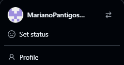

**3º Paso**<br>
Entramos ahi y se nos abrira una nueva interfas. En la parte de arriba veremos un apartado que se llama repositorio

 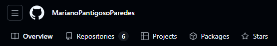

 **4º Paso**<br>
 Hacemos click y le damos a **nuevo** 

 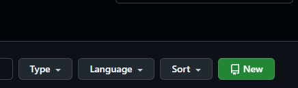<br>

**5º Paso**<br>
A continuacion veremos una interfaz donde nos pedira llenar los datos como el nombre, si queremos que sea privado o publico **(si mas adelante vamos a querer utilizar el github pages lo tenemos que poner en publico tambien lo podremos cambiar mas adelante)** entre otras cosas, lo llenamos depende de como lo pida el profesor. Marcamos la opcion Readme para que el repositorio se cree y se inicialice automaticamente en GitHub <br>
**En caso que no se marque esta opcion el repositorio se creara vacio** <br>

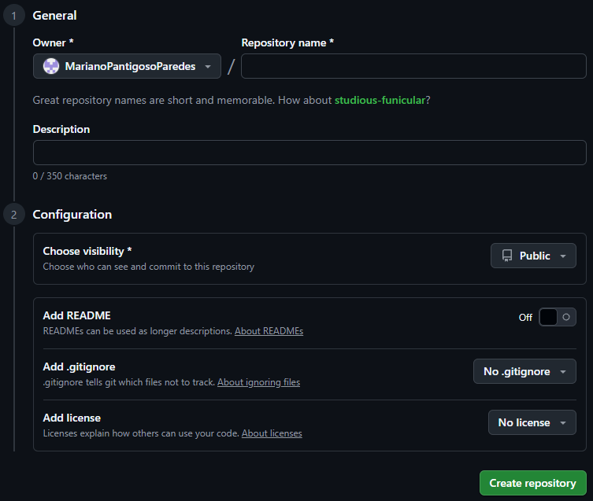

**6º Paso**<br>
Una vez creada el repositorio local, nos desplazamos a la raíz del repositorio clonado para trabajar con él, realizar modificaciones y sincronizar los cambios con GitHub cada vez que queramos, y para hacer esto implementamos estos comandos

- **git init:** 
Este comando nos servira para inicializar el repositorio de nuestro local con el de la pagina web

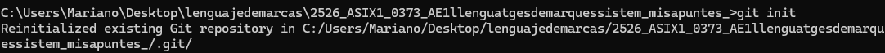

- **git add . :**
Este comando servira para agregar los elementos que hemos puesto en la nueva version

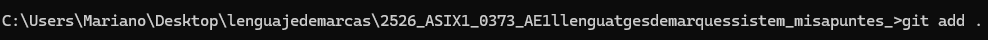

- **git commit -m "AÑADIR TITULO":**
Este comando servira para añadir una descripcion de lo que agregamos al repositorio

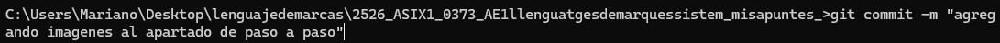

- **git push origin main:**
Este comando servira para sincronizar los elementos y subirlos tambien a la pagina del git

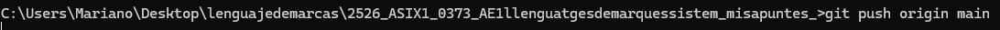

## A- Crear un repositorio local nuevo desde línea de comandos (GIT).
Para crear un repositorio local nuevo y sincronizarlo con un repositorio de GitHub no inicializado, osea vacío ya que no se uso la opcion README. Lo que haremos es hacerlo desde la carpeta “raíz” del repositorio local. Iremos en local hasta la carpeta raíz de los repositorios locales y creamos una carpeta nueva para el repositorio local a vincular con el repositorio vacío e inicializado en GitHub. La carpeta se tiene que llamar igual que el repositorio de GitHub. <br>
- **echo "# BORRAR" >> README.md:**
Creamos el archivo readme.md con el contenido que queramos 
- **git init:**
Inicializamos el repositorio GIT local vacío en la carpeta donde estamos situados.
- **git add README.md:**
Añadimos el archivo readme al repositorio local. Si ponemos git add . añadimos todos los archivos al repositorio local.
- **git branch -M main:**
Asociamos la versión a la rama de desarrollo que queramos. La rama por defecto es “main”
- **git commit -m "first commit":**
Este comando es un conjunto de cambios que se realizan en los archivos del repositorio (modificar, añadir, eliminar, mover, renombrar, etc). Creamos el paquete de archivos a sincronizar con el repositorio remoto.
- **git remote add origin:**
Asociamos un repositorio remoto indicando un identificador (origin) y su URL<br>
- **git push -u origin main:**
Este comando nos permitira hacer los cambios al repositorio remoto y rama indicadas en los puntos anteriores.

## B- Sincronizar un repositorio local ya existente desde linea de comandos
Navegamos en local hasta la carpeta raiz del repositorio local a vincular con el repositorio vacio creado e inizializado previamente en GitHub
- **git init:** 
Inicializamos el repositorio
- **git remote add origin:** 
Una vez situados en la carpeta añadimos como origen de ese repositorio al repositorio vacio de GitHub
- **git branch -M main:**
Asociamos la version a la rama de desarrollo que queramos 
- **git commit -m "first commit":**
Este comando sirve para hacer cambios que se realizan en los archivos del repositorio. Creamos el paquete de archivos a sincronizar con el repositorio remoto 
- **git push -u origi main:**
Subimos los cambios al repositorio remoto 
## ¿Como importar en GitHub un repositorio ya existente?
**1º Paso**<br>
Vamos al repositorio, le hacemos click en la pestaña verde que se llama **Code** y copiamos la url que nos sale 

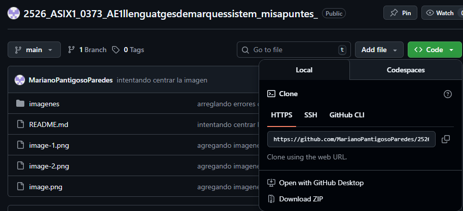

**2º Paso**<br>
En repositorios vamos a crear un repositorio nuevo

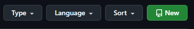

Veremos una opcion que nos pondra **importar repositorio**

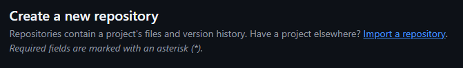

En **old repository’s clone URL** pegamos la URL del repositorio que queremos importar mientras que en **Repository Name** ponemos el nombre que queremos que tenga nuestro repositorio clonado

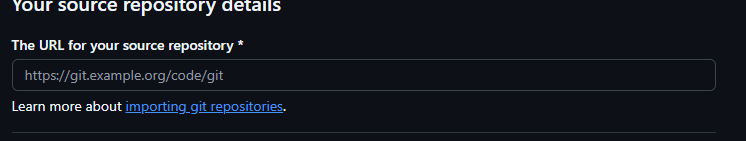

**3º Paso** <br>
Por ultimo paso elegimos si queremos que el repositorio sea privado o publico 
## ¿Como activar GitHub Pages?
**1º Paso** <br>
Iremos a nuestro repositorio al apartado configuracion 

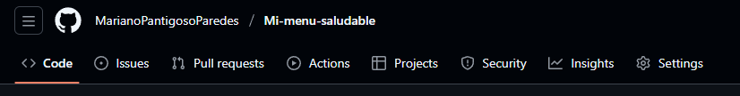 

**2º Paso** <br>
Iremos a la opcion **PAGES** que esta en la parte inferior izquierda <br>
**Recuerda que el repositorio tiene que ser publico para poder hacer esto** <br>
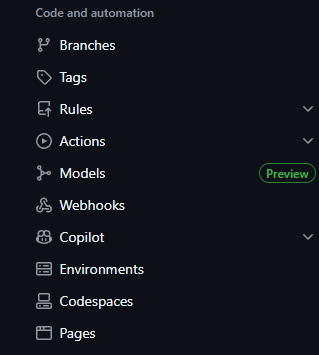 

**3º Paso** <br>
Escogemos a que rama asociar pages por defecto a **main** y a que carpeta por defecto **root** y guardamos la configuracion 

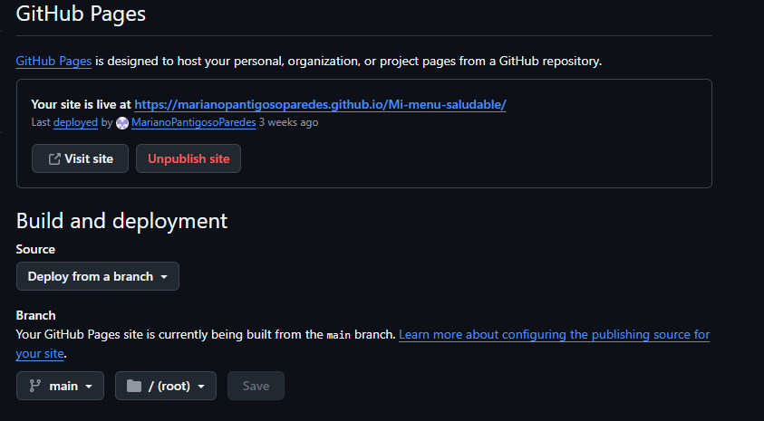

# MARKDOWN 
Es un lenguaje de marcado de codigo abierto creado por John Gruber. Contiene texto plano formateado. Este archivo se compone de un nombre y una extension que en este caso la de Markdown es **.md** 
## Etiquetas Negrita, cursiva y texto tachado
- Hay 2 formas de poner en negrita las frases o palabras. Se usa doble * o el doble guion bajo __ <br>
**TEXTO EN NEGRITA** o __TEXTO EN NEGRITA__         <!-- Se usa doble * o el doble guion bajo __ -->

Esta seria la sintaxis:

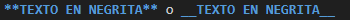

- Hay 2 formas de poner en cursiva las frases o palabras. Se usa un * o un guion bajo _ <br>
*TEXTO EN CURSIVA* o _TEXTO EN CURSIVA_             <!-- Se usa un * o una guion bajo _ -->

Esta seria la sintaxis:

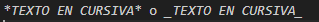

- Hay 2 formas de poner en negrita y cursiva las frases o palabras. Se usa triple * o triple guion bajo <br>
***TEXTO EN NEGRITA Y CURSIVA*** o ___TEXTO EN NEGRITA Y CURSIVA___   <!-- Se usa triple * o triple guion bajo ___ -->

Esta seria la sintaxis:

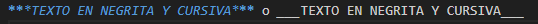

- Para poner texto tachado las frases o palabras usaremos este signo ~ <br>
~~TEXTO TACHADO~~                   <!-- se usa ~~ al inicio y final-->

Esta seria la sintaxis:

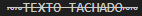

## ENCABEZADOS
Usamos # para crear titulos. Cuantos mas # mas pequeño es el encabezado. Esta es la sintaxis:

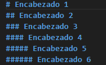

Y se veria asi en la pagina:

# Encabezado 1              <!--En este caso puse encabezado como ejemplo, pero ahi iria el titulo de tu documento -->
## Encabezado 2
### Encabezado 3
#### Encabezado 4
##### Encabezado 5
###### Encabezado 6

## LISTAS
Esta es la sintaxis de una lista no ordenada:

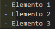

Y se veria asi en la pagina:
 - Elemento 1                   
 - Elemento 2          <!-- elementos vendria a ser el ejemplo aqui ustedes pueden poner cualquier cosa sin importar el orden ya que  es desordenada-->
 - Elemento 3 

Esta es la sintaxis de una lista enumerada:

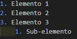

Y asi se veria en la pagina:
1. Elemento 1
2. Elemento 2           <!-- elementos vendria a ser el ejemplo aqui ustedes pueden poner cualquier cosa, aqui el orden si importaria-->
3. Elemento 3
    1. Sub-elemento

## CITAS Y CITAS ANIDADAS
<!--Citas-->
Una cita es para resaltar o citar texto, igual que en los correos o articulos. Se usa este simbolo >
Esta es la sintaxis:

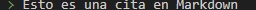

Y se veria asi en la pagina:
> Esto es una cita en Markdown 
<!--Citas anidadas-->
Una cita anidada es una cita que esta dentro de otra
Esta es la sintaxis:

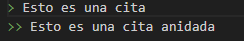

Y asi se veria en la pagina:
> Esto es una cita
>> Esto es una cita anidada

## BLOQUES DE CODIGO
Para usar bloques de codigo agregaremos las ´´´ comillas por ejemplo si queremos usar html o cualquier otro lenguaje de programacion

Esta es la sintaxis:

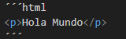

Y asi se veria en la pagina:

```html
<p>Hola Mundo</p>
```

## IMAGENES
- Para poner imagenes en markdown desde nuestra pc local, osea descargada usaremos el siguiente codigo, no olviden de poner bien la ruta:
La sintaxis seria la siguiente:


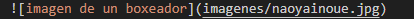

Y asi se veria en la pagina:


- Para poner imagenes en markdown desde una pagina web pondremos el siguiente codigo, recuerda que debe de estar en formato **PNG, JPEG, JPG**:
La sintaxis seria la siguiente:


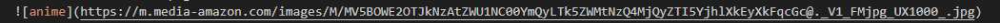

Y asi se veria en la pagina:


## ENLACES
Primero se incluye el texto del link entre corchetes y posteriormente el link entre parentesis

La sintaxis seria la siguiente:

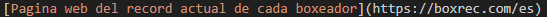

Y en la pagina se veria asi

[Pagina web del record actual de cada boxeador](https://boxrec.com/es)

## TABLAS 
Se usan barras verticales | para separar columnas y guiones - para crear el encabezado.

La sintaxis seria la siguiente:


Y en la pagina se veria asi:

| NOMBRE | EDAD | PAIS |
| ----------- | ---- | ------------- |
| Mariano | 20 | Perú |
| David | 20 | Colombia |
| Carlos | 20 | Uruguay |
| Adrian | 21 | Paraguay |

## HTML
¿Que es HTML?

LENGUAJE DE MARCAS HTML (1991)

Sirve para estructurar contenidos en páginas web, lo q hace es definir enlaces entre diferentes documentos que están entrelazados entre sí. No se dedica para poder interactuar con el contenido solo estructura. 
Cada etiqueta de html empiezan con un menor que y acaban con un menor que y en el medio el nombre de la etiqueta 

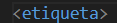

<etiqueta>

**Hipertext**: Es el texto que que se enlaza con otros contenidos. Esto es la base del funcionamiento de la web tal y como la conocemos, que no es mas que paginas y recursos interconectados.

**markup**: Todas las paginas estan construidas por etiquetas

**Lenguaje**: Formado por etiquetas que generan hipertextos
Todas las etiquetas tienen etiquetas de inicio y algunas no tienen de cierre; inicio: '&lt;p&gt;' y cierre '&lt;/p&gt;'

**Atributo**: Están dentro siempre de las etiquetas de apertura nunca los de cierre, por ejemplo:

Aqui class es el nombre del atributo y editor-note es el valor del atributo, en este caso, el atributo class permite darle al elemento un nombre identificativo, que se pueda utilizar luego para apuntarle al elemento informacion de estilo y demas cosas.

La sintaxis seria la siguiente:

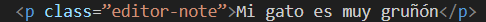

Y en la pagina web se veria asi:

<p class=”editor-note”>Mi gato es muy gruñón</p>

## ESTRUCTURA DE HTML

Esta es la estructura de html a continuacion les ire diciendo que es cada etiqueta que hay dentro y su funcion.

```html
<!DOCTYPE html>
<html lang="en">
<head>
    <meta charset="UTF-8">
    <meta name="viewport" content="width=device-width, initial-scale=1.0">
    <title>Estructura de HTML</title>
    <link rel="icon" href="multimedia/kiwi.svg">
</head>
<body>

</body>
</html>

```

&lt;!DOCTYPE html&gt;
 
 Indica que el documento está escrito en HTML5. Esto ayuda al navegador a interpretarlo correctamente.

 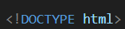

&lt;html lang="es" &gt; 

 Es la etiqueta raíz de todo el documento. El atributo lang="es" indica el idioma (en este caso, español).

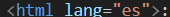

 &lt;head&gt;

Contiene información interna o metadatos del sitio que no se muestran directamente en la página.

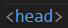

&lt;/head&gt;

Cierra la sección del encabezado.

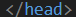

&lt;meta charset="UTF-8"&gt;

Define el tipo de codificación de caracteres (UTF-8 permite usar tildes, ñ, etc.).

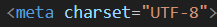

&lt;meta name="viewport" content="width=device-width, initial-scale=1.0"&gt;

Hace que la página se vea bien en dispositivos móviles.

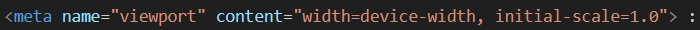

&lt;title&gt;

Título que aparece en la pestaña del navegador.

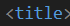

&lt;p&gt;

Es un párrafo de texto.

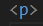

&lt;body&gt;

Aquí va todo el contenido visible de la página: texto, imágenes, enlaces, botones, etc.


&lt;/body&gt;

Cierra el cuerpo del documento.

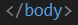

&lt;/html&gt;

Cierra el documento HTML.

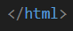


## ELEMENTOS DE BLOQUE HTML

- **Encabezados y titulos**

Los titulos y encabezados van desde el &lt;h1&gt; hasta el &lt;h6&gt;, y se veria tal que asi en nuestra pagina web:

<!DOCTYPE html>
<html lang="en">
<head>
    <meta charset="UTF-8">
    <meta name="viewport" content="width=device-width, initial-scale=1.0">
    <title>Estructura de HTML</title>
    <link rel="icon" href="multimedia/kiwi.svg">
</head>
<body>
     <h1> TITULO PRINCIPAL</h1>
    <h2> SUBTITULOS </h2>
    <h3> SUB-SUBTITULO </h3>
    <h4> ENCABEZADO 4 </h4>
    <h5> ENCABEZADO 5 </h5>
    <h6> ENCABEZADO 6 </h6>
</body>
</html>

El codigo que usaremos sera el siguiente: 

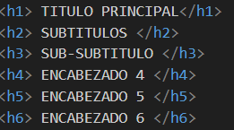

- **Salto de linea**
Para hacer un salto de linea en html usaremos el &lt;br&gt;

A continuacion les pondre un ejemplo de como se veria
<p>Hola me llamo Mariano</p> <br>
<p>Hola me llamo Johan</p>

El codigo que implementamos fue el siguiente: 

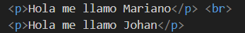

- **Separador**
Para incluir un separador en html usaremos el &lt;hr&gt;. Esto sirve para separar secciones de contenido dentro de una página web con una línea horizontal.

A continuacion les pondre un ejemplo de como se veria

<h2>Separador</h2><hr>
<p>Esto es un separador</p>

El codigo que implementamos fue el siguiente:

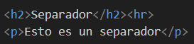

## ELEMENTOS DE LINEA

- **Enfasis o cursiva**
Para usar enfasis o cursiva usaremos el &lt;em&gt;

A continuacion les pondre un ejemplo de como se veria en la pagina y el codigo implementado

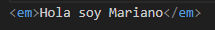

<em>Hola soy Mariano</em>

- **Negrita**
Para poner en negrita un texto usaremos el &lt;strong&gt;, tambien se podria usar el &lt;br&gt; pero es muy antiguo y habria navegadores que tendrian problema en reconocerlo

A continuacion les pondre un ejemplo de como se veria en la pagina y el codigo implementado

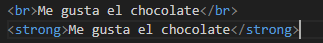

<br>Me gusta el chocolate</br>
<strong>Me gusta el chocolate</strong>

## RESUMEN DE NORMAS BASICAS DE HTML
- Las etiquetas de html normalmente vienen en pares, con una etiqueta de cierre y otra de apertura
- Algunas etiquetas son vacias osea que no tienen etiqueta de cierre como por ejemplo: &lt;img&gt;, &lt;br&gt;, y &lt;input&gt;
- Las etiquetas siempre deben anidarse correctamente para que funcionen 
- Las atributos de las etiquetas se esepcifican en la etiqueta de apertura y su formato es **nombre=="valor"**
- Aunque las etiquetas y atributos funcionen con mayusculas o minusculas, la recomendacion es que todo se escriba en minuscula

## COMENTARIOS
En un documento html podemos poner anotaciones que no se veran en la pagina web, pero son muy utiles para el desarrollador web, ya que hay que pensar que no siempre trabajaremos solos y es muy importante comentar el codigo fuente sobre todo si se trata de un documento muy largo

La estrucutra de un comentario es la siguiente
<!-- Esto es un comentario en HTML -->

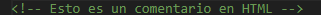

Y en un documento se veria asi

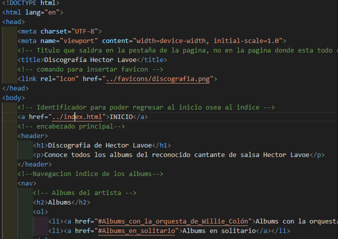

## LISTAS
- **Listas ordenadas**

Son aquellas en las que el orden de los elementos si importan. Estan dentro del elemento &lt;ol&gt; que significa **orden list** y dentro de ahi van las &lt;li&gt; que significa **list item**. Aqui al abrir la etiqueta dentro de ahi podemos escribir **type=""** y dentro de las comillas poner A, a, l, 1 para que coja diferentes estilos la lista.

A continuacion les pondre un ejemplo de como se veria en la pagina y el codigo implementado

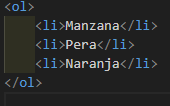

<ol>
    <li>Manzana</li>
    <li>Pera</li>
    <li>Naranja</li>
</ol>

Tambien podemos añadir parametro como **start=n** que se fuerza la numeracion a partir de un determinado valor, añadiendo el parametro **value=n** se fuerza a que el elemento tenga el numero de orden que indiquemos 

- **Listas desordenadas**

Son aquellas en las que el orden de los elementos no importan. Estan dentro del elemento &lt;ul&gt; que significa **unordered list** y dentro de ahi van las &lt;li&gt; que significa **list item**. Aqui al abrir la etiqueta dentro de ahi podemos escribir **type=""** y dentro de las comillas poner DISC, SQUARE y CIRCLE, para que coja diferentes estilos la lista

A continuacion les pondre un ejemplo de como se veria en la pagina y el codigo implementado

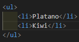

<ul>
    <li>Platano</li>
    <li>Kiwi</li>
</ul>

## RUTAS
- **Ruta relativa**: Especifica la ubicacion del archivo en relacion con la ubicacion del documento actual

A continuacion les pondre un ejemplo de como se veria en la pagina y el codigo implementado

En este ejemplo pondremos una imagen en el indice

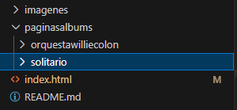

El codigo implementado sera el siguiente


**alt** es el texto que saldria si en caso no carga la imagen, tambien podemos ajustar las medidas de las imagenes con **width** y **height**

- **Ruta absoluta**: Especifica la ubicacion del archivo en la web, comenzando desde el dominio. Es util cuando el archivo se encuentra en un servidor diferente o en una ubicacion especifica de la web. Aqui no hace falta tener la imagen descargada. Pondrias el mismo codigo que en el de la ruta relativa y solo cambiariamos el src que esta vez seria la url de la imagen

## IMAGENES 
Son un recurso importante para las paginas webs ya que las hacen mas llamativas y nos permite proporcionar informacion de manera visual. La etiqueta que usaremos sera **&lt;img&gt;**, usaremos el atributo **src** para poner la ubicacion de la imagen. Tambien usaremos **alt** que es el texto que saldria si en caso no carga la imagen, tambien podemos ajustar las medidas de las imagenes con **width** y **height**

## ENLACES
Es el sistema que nos permite esta navegacion se llama hipertexto. La etiqueta de html para crear estos enlaces es **&lt;a&gt;**, es una etiqueta de linea ya que podemos colocar enlaces rodeados de texto, para indicar cual es nuestro destino utilizamos el atributo **href**

- **Enlaces a paginas externas**

Si queremos hacer un enlace a una pagina externa, como por ejemplo al sitio web https://www.youtube.com, y el texto que queramos que aparezca en el navegador es "youtube". El codigo que implementaremos sera el siguiente:

<a href="https://www.youtube.com" tittle="Pagina_youtube">Youtube</a>


- **Enlaces a paginas locales**

Si el enlace que queremos hacer esta en dirigido a documento local nuestro, podemos usar la ruta relativa al archivo al cual queremos enlazar el atributo **href** 

Por ejemplo en este caso queremos ir desde discografia hasta index, nuestro documento esta organizado de esta forma


Y el codigo que implementariamos seria el siguiente


- **Enlaces a etiquetas dentro del propio codigo html**

Como algunos documentos htmnl son muy extensos y puede interesarnos navegar por la misma pagina. Para hacer esto debemos poner etiquetas que indiquen a los lugares donde queremos ir y crear enlaces con esos puntos 

Por ejemplo en un indice si queremos ir rapido al apartado que queremos usaremos el siguiente codigo

Al **href** le pondremos una almohadilla para enlazarlo con el **id** del titulo que queremos ir. En el **id** no se pondria la almohadilla


## CONTENEDORES DIV
Un contenedor **&lt;div&gt;** sirve para agrupar diferentes elementos en una pagina web. Es como un bloque donde puedes poner texto, imagenes,formularios, u otro contenido y luego aplicar estilos o realizar acciones con javascript

- **Para que sirve**

Es para organizar contenido, dividir la pagina en secciones osea puedes tener un div para cabezera, otro para el cuerpo y otro para el pie de pagina

Puedes darle un aspecto diferente a cada seccion usando CSS, como cambiar colores, tamaños o alineaciones

Te permite trabajar con partes especificas del contenido de la pagina cuando haces programacion con JavaScript

Y el codigo seria asi 


## ELEMENTOS SEMANTICOS 
Es la clave de saber usar HTML correctamente, permite agrupar contenidos en linea y contenido en bloque.

Ejemplos de elementos semanticos son el : &lt;header&gt;, &lt;footer&gt;, &lt;article&gt;, &lt;section&gt;, &lt;nav&gt; y &lt;figure&gt;


Se dividiria asi en un documento html


## FORMULARIOS
-  **&lt;form&gt;**

Se utiliza para crear formularios, que permiten al usuario enviar datos.

Atributos comunes son:

**&lt;action&gt;**: Define la url donde se enviaran los datos del formulario <br>
**&lt;method&gt;**: Especifica el metodo de envios de datos <br>
**&lt;enctype&gt;**: Define como se codifican los datos antes de ser enviados al servidor <br>
**&lt;target&gt;**: indica donde se deben mostrar la respuesta al enviar el formulario. El **_self** la respuesta se carga en la misma ventana y con **_blank** se abre en una pestaña nueva <br>

- **&lt;input&gt;** 

Se utiliza para crear diversos tipos de campos interactivos en un formulario

Atributos comunes son: 

**&lt;type&gt;**: Define el tipo de entrada que se debe mostrar <br>
**&lt;id&gt;**: Identificador unico para el campo, que se puede usar para asociar el &lt;label&gt; con el campo de entrada <br> 
**&lt;name&gt;**: Nombre del campo de entrada que se utiliza al enviar el formulario para identificar el dato <br>
**&lt;value&gt;**: Valor predeterminado del campo de entrada o el valor enviado al servidor si el campo no es interactivo <br>
**&lt;placeholder&gt;**: Texto que aparece en el campo cuando esta vacio, ofreciendo una pista sobre que tipo de datos se debe ingresar <br>
**&lt;required&gt;**: Indica que el campo debe completarse antes de enviar el formulario <br>
**&lt;disabled&gt;**: Desactiva el campo, evitando que el usuario interactue con el <br>
**&lt;redonly&gt;**: Hace que el campo sea solo de lectura, evitando que el usuario modifique su contenido <br>

## ETIQUETAS DE FORMULARIO 

- **&lt;input type="radio"&gt;**: Boton de opcion, se agrupa con otros del mismo nombre

- **&lt;input type="checkbox"&gt;**: Casilla de verificacion, permite selecciones multiples         

- **&lt;select&gt;**: Se utiliza para crear menus desplegables en los formularios

- **&lt;option&gt;**: Permite al usuario seleccionar una opcion de una lista de opciones predefinidas

Los atributos comunes para **select** y **option** son: 

**name**: Especifica el nombre del control que se usara al enviar el formulario <br>
**id**: Identificador unico del elemento, que puede usarse para asociar una etiqueta **&lt;label&gt;** <br>
**size**: Define el numero de opciones visibles en la lista desplegable sin necesidad de desplazar <br> 
**multiple**: Permite seleccionar varias opciones a la vez <br>
**value&**: Indica el valor de opcion

- **&lt;textarea&gt;**: Se usa para crear un area de texto en la que los usuarios pueden ingresar multiples lineas de texto. Es util para mensajes largos o descripciones detalladas.

Los atributos comunes son:

**name**: Especifica el nombre del control que se usara al enviar el formulario<br>
**id**: Identificador unico del elemento, que puede usarse para asociar una etiqueta **&lt;label&gt;**<br>
**rows**: Define el numero de lineas visibles en el area de texto y especifica la altura de la caja<br>
**cols**: Define el numero de caracteres visibles en linea. Especifica el ancho de la caja de texto<br>
**placeholder**: Texto que aparece en el area del texto cuando esta vacio <br>
**required**: Indica que el campo debe completarse antes de enviar el formulario<br>
**readonly**: Hace que el campo sea solo de lectura, evitando que el usuario modifique su edicion<br>
**disabled**: Desactiva el campo, evitando que el usuario interactue con el<br>

- **&lt;button&gt;**: Se utiliza para crear varios tipos de botones interactivos en el formulario o en una pagina web

Los atributos comunes son:

**type**: Define el tipo de boton. 

Los valores mas comunes son:

**submit**: Envia el formulario cuando se hace click en el boton<br>
**reset**: Restablece los campos del formulario a sus valores iniciales <br>
**name**: Define el nombre del boton que sera enviado con los datos del formulario si el boton tiene el atributo type="submit"<br>
**value**: Especifica el valor que se envia al servidor si el boton es de tipo submit<br>
**disabled**: Desactiva el boton, impidiendo que se haga cli en el o que se envie el formulario si es un boton de envio<br>

## TABLAS
Son un recurso que nos permite mostrar informacion tabulada en filas y columnas. El mejor uso que le podemos dar a las tablas es el de mostrar informacion tabular 

- **&lt;table&gt;**: Define el inicio de una tabla en HTML <br>

Atributos comunes:

**border**: Define el grosor del borde de la tabla

**width**: Especifica el ancho de la tabla

- **&lt;thead&gt;**: Agrupa el encabezado de la tabla, normalmente contiene las etiquetas **&lt;th&gt;** <br>
- **&lt;tbody&gt;**: Agrupa el cuerpo de la tabla. Util para separar el contenido del encabezado y pie <br>
- **&lt;tfood&gt;**: Agrupa el pie de tabla generalmente utilizado para resumen o informacion final <br>
- **&lt;tr&gt;**: Define una fila en tabla <br>

Atributos comunes:

**align**: Alinea el contenido en la fila (left,right, center)

**bgcolor**: Define el color de fondo de la fila

**align**: Alineacion horizontal

**valign**: Alineacion vertical

- **&lt;th&gt;**: Define una celda de encabezado en una tabla <br>

Atributos comunes:

**colsplan**: Define cuantas columnas abarca la celda

**rowspan**: Define cuantas filas abarca la celda

- **&lt;td&gt;**: Define una celda de datos dentro de una fila de tabla <br>

Atributos comunes:

**colsplan**: Abarca varias columnas

**rowspan**: Abarca varias filas

**align**> Alinea el contenido dentro de la celda (left, right, center)

- **&lt;caption&gt;**: Proporciona un titulo o una descripcion para la tabla, normalmente se coloca justo despues de la etiqueta **&lt;table&gt;**<br>

Atributos comunes:

**align**: alinea el titulo respecto a la tabla (top, bottom, left, right)

## CSS
 Es un lenguaje informático especializado en definir y dar estilo a la presentación de un documento escrito en un lenguaje de marcado como HTML o XML.
 Su principal función es separar el contenido del documento (HTML) de su forma de presentación, lo que permite controlar aspectos visuales como **colores, fuentes, diseño, disposición de elementos y animaciones** sin alterar la estructura del contenido.

## EVOLUCION 
Lo que conocemos como CSS aparecio cuando el W3C recibio 9 propuestas diferentes para hojas de estilo, de los cualkes selecciono dos: **Cascading HTML Style Sheets (CHSS)**, Propuesta por HAkon Wium Lie en 1994 y **Stream-based Style Sheet Proposal (SSP)**. De ahi nacieron las Cascading Style Sheets (CSS),cuya primera version, denominada CSS level 1, fue propuesta como estandar a finales del año 1996.
En mayo de 1998 se publico el estandar CSS Level 2. Diez años despues en 2008, se realizo una revision y se publico el CSS Level 2 Revision 1, conocido como CSS2.1.
Actualmente se esta trabajando con CSS3. En este caso la especifiacion esta dividia en modulos algunos de los cuales ya se han convertido en estandares, mientras que otros aun estan en desarrollo.

## VENTAJAS 
Las ventajas son: 
* Posibilidad de mantener el codigo mas facilmente
* A nivel de diseño, CSS es mas potente que las etiquetas de diseño de **(X)HTML**
* Es un lenguaje sencillo
* Se pueden definir diferentes hojas de estilo para un solo documento
* Se pueden reutilizar desde diferentes documentos

## INCONVENIENTES 
El gran inconveniente es que no todos los navegadores soportan de la misma forma ante una hoja de estilo dado que algunos no cumplen con los estandares establecidos. Asi obligan al programador a crear diferentes hojas de estilo

## UBICACION 
Se pueden asociar de diferentes formas
* Estilo "inline": En la propia etiqueta
* Estilo "interno": En la cabecera del documento HTML
* Estilo "externo": En un documento externo, la mas utilizada

### INLINE
Se añaden las propiedades CSS directamente en el elemento usando el atributo **"style"**
* Esto dentro de la etiqueta p. La limitacion de hacerlo en una linea es q no podemos mezclar codigos de lenguaje, tienen q estar en una seccion especifica esto es la primera forma de hacerlo q no estaria del todo bien, esto seria metodo etiqueta.


### INTERNO
En la cabecera del documento HTML. Podemos poner diferentes propiedades CSS dentro del elemento &lt;style&gt; y dentro del elemento &lt;head&gt; del documento


### EXTERNO
En este metodo se coloca las propiedades de estilo en una hoja externa con extension **.css** y desde el documento HTML se enlaza con esta hoja de estilo con la etiqueta &lt;link&gt;

* Asi se veria el nombre de la extension de la hoja externa


* Aqui iria el href de la hoja externa, con la etiqueta link


## PRIORIDAD
Pueden darse el caso de que varias declaraciones CSS afectasen de forma diferente a un mismo elemento HTML, a continuacion veremos cuales tienen preferencia

* En primer lugar, se comprueba si existe una hoja de estilos externa asociada al documento HTMl (estilo externo). Si no estilos en otras ubicaciones son las que se ejecutaran

* En segundo lugar, si hay alguna definicion de estilos en el **HEAD** del documento HTML (estilo intenro). En este casi, si alguna definicion contradice a la definida en la hora de estilos externa, tendra prioridad la definicion del estilo interno

* Por ultimo, si hay alguna definicion de estilos **inline**, en la propia etiqueta HTML, en caso de contradiccion, tendra prioridad la definida en la propia etiqueta

### PRIORIDAD POR ESPECIFICIDAD
La especifidad se calcula en funcion de un sistema de puntuacion basado en las partes del selector

* **Inline styles (atributo style en HTML)**
Especificidad = 1000
Ejemplo: &lt;div style="color:red"&gt;

* **Selectores de ID (#id)**
Especificidad = 100
Ejemplo: #header 

* **Selectores de clase, atributos y pseudoclases (.class, [attr=value], :hover):**
Especificidad = 10
Ejemplo: .main, [type="text"], :focus

* **Selectores de elementos y pseudoelementos (h1, p, ::before):**
Especificidad = 1
Ejemplo: h1, p

* **Universal selector (*), combinadores (+,>,~) y pseudo-clases universales (:is, :not) no suman especificidad por si mismos**

### PRIORIDAD DE ORDEN DE APARICION
Si dos selectores tienen la misma especificidad, gana el ultimo declarado en el archivo CSS o en las hojas vinculadas. Ejemplo: color:red& !important, **tendra prioridad sobre cualquier otra regla, incluso si tiene menor especificidad**

### PRIORIDAD DE REGLAS IMPORTANTES (!IMPORTANT)
Una regla con !important sobrescribe cualquier otra regla independientemente de la especificidad

### PRIORIDAD DE HERENCIA
Propiedades como color, **font-family, etc** pueden heredarse pero tienen menor prioridad que una regla aplicada directamente
<br>

## TIPOS DE SELECTORES
Hay diferentes tipos de selectores, los mas basicos son:

1. Selectores de elementos
2. Selector de id
3. Selector de clase

Y los avanzados que son

1. Selector universal
2. Selector de atributos
3. Selector de hijos
4. Selector de descendientes
5. Selector de hermanos adyacentes
6. Pseudoclases
7. Pseudoelementos

###  SELECTORES BASICOS CSS <br>

Un selector nos sirve para definir a que elemento o elementos queremos aplicar las declaraciones de la regla. Las declaraciones son las diversas caracteristicas que han de cumplir los elementos que concuerdan con el selector.

La estructura que usariamos seria la siguiente 


Y en un ejemplo practico seria tal que asi. Aqui p es el selector


1. SELECTORES DE ID 

Los selectores de id es mediante un **id** que corresponden a todos los elemtos de HTML que tiene un atributo id con el valor especificado, osea si queremos darle estilo a ese id, a todas las etiquetas que tengan ese id se les aplicaria

Aqui nosotros pusimos el mismo id a la etiqueta p y al h1


En el css aplicamos este estilo, **cuando usemos id y le queremos dar estilo siempre colocaremos la # porque sino no lo reconoce**


Y en la pagina web se veria asi 


2. SELECTORES DE ELEMENTO 

Los selectores de elementos consiste en poner el nombre de una etiqueta en el css y esto hara el cambio en todas las etiquetas de esa pagina. Aqui podemos ver que aplicamos un color de letra, tamaño de letra y espacio de lineas 


Y en la pagina se veria asi


3. SELECTORES DE CLASE

Los selectores de clase corresponde con todos los elementos que tenga el atributo **"class"** con el valor especificado


- En la sintaxis hay la propiedad y el valor <br>
Aqui la propiedades serian **font-family y font-style** y el valor seria **oblique y couriernew,courier,monospace**


- Los comentarios en css son muy utiles ya que nos serviria mas facil para identificar donde se aplican los estilos. Para ponerlos se usa /**/


### SELECTORES AVANZADOS

1. SELECTOR UNIVERSAL 

Sirve para seleccionar todos los elementos de la pagina. Aqui lo que estamos haciendo es que a toda la pagina se el margin y padding tengan un valor de 0 y que toda la pagina tenga el mismo tipo de letra


2. SELECTOR DE ATRIBUTOS

Permite seleccionar elementos en funcion de los atributos que contienen. Por ejemplo aqui yo puse dos imagenes una con alt y otra sin alt


Puse el siguiente codigo en css para que solo se aplique a la etiqueta img que contenga alt


Y  en la pagina se veria tal que asi. Como podremos observar solo cambio la imagen donde hay algo dentro del alt la otra no porque esta vacia o no existe dentro de la equiqueta img 


La otra forma que podemos hacerlo es atraves del src **en este caso porque usamos la etiqueta de imagen**, si usamos otra etique tambien podriamos usar uno de sus atributos para hacerlo


Y en la pagina veremos que cambio


3. SELECTORES DE HIJOS

Sirven para seleccionar elementos concretos que son hijos directos de otros elementos en concreto. Ose que si en un h2 hay un strong y tengo mas strong en otras etiquetas y pongo la siguiente sintaxis:


Esto solo se aplicara a los strong que tenga h2, si hay mas en otras etiquetas no se aplicara 

- Aqui podemos ver que stron esta en h2 y en la etiqueta p


- Aplicamos el css anterior y en la pagina se veria asi. Solo cambia lo del titulo porque lo otro no esta dentrodel h2


4. SELECTORES DE DESCENDIENTES

Es similar al selector de hijos pero a diferencia de ellos, que solo seleccionan elementos descendientes directos. Estos selectores seleccionan elementos indicados en cualquier punto de la jerarquia del elemento y no solo a los descendientes. 

- Aqui podemos ver que dentro del div hay un h2, p, img, strong y em. Y nosotros queremos que el estilo que pongamos solo afecte al em


- En el css se aplicaria de esta forma para que solo afecte al em. Aqui lo que estamos diciendo es que dentro del div seleccionaremos el descendiente em


- Y en la pagina se veria asi solo se aplica en el pedazo de la etiqueta em


5. SELECTORES DE HERMANOS ADYACENTES

Permiten seleccionar un elemento concreto que aparece directamente despues de otro elemento concreto al mismo nivel de jerarquia del elemento. Si esta mas abajo o los separa algo no se podria hacer

- Aqui podemos ver quien es hermano adyacente de h1 y quien no


- El codigo en css seria asi 


- En la pagina web se veria asi. Aqui podemos notar que solo afecta al h1 y al primer h2


6. SELECTORES PSEUDOCLASES

Se utilizan para definir estilos, no para elementos sino para sus estados. Uno de los mas habituales es aplicar estilos a los estados de enlaces

- :link: El estado normal por defecto de los enlaces. Tal y como se ven por primera vez
- :visitedd: Enlaces que ya se han visitado con el navegador que se esta utilizando
- :focus: Enlaces(campos de formularios, o cualquier otra cosa) que tienen en ese momento el cursor en su inferior
- :hover: Enlaces que tienen en este momento el puntero del raton sobre ellos

7. SELECTORES PSEUDOELEMENTOS

Al igual que los pseudoclases, no afectan a todo el elemento sino que permiten añadir estilos a **una parte concreta**. Por ejemplo el pseudoelemento **:first-line** selecciona solo la primera linea del elemento especificado por el selector


- Y en la pagina web se veria asi


## GOOGLE FONTS

La visualizacion de una tipografia depende de que esta este instalada en el ordenador donde se va a visualizar la web, tambien podemos añadir mas tipografias a nuestros diseños mediante el uso de tipografias online como por ejemplo las que ofrece google en su web.

1. Para usarlas tenemos que ir primero a su pagina web 

2. Buscamos el tipo de letra y entramos en ella 


3. Le damos a get font 


4. Cuando le demos click ahi nos saldra las opciones para conseguir el codigo de la fuente o descargar todo


